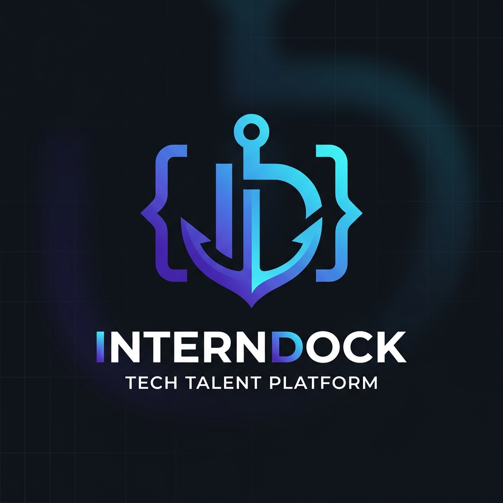
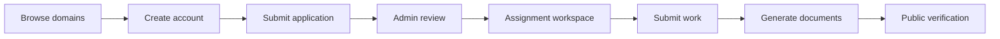

# InternDock

> A full-stack internship platform for discovering programs, managing applications, coordinating assignments, and generating verified internship documents.

<p align="center">
	
</p>

<p align="center">
	<strong>Discover. Apply. Build. Get recognized.</strong><br />
	A focused workspace for interns, program teams, and administrators.
</p>

<p align="center">
	<a href="https://github.com/amanmishra2005/InternDock">Repository</a>
	&nbsp; · &nbsp;
	<a href="https://github.com/amanmishra2005/InternDock/issues">Report an issue</a>
</p>

## What InternDock Does

InternDock brings the internship lifecycle into one place:

- **Explore programs** by domain, duration, skills, and descriptions.
- **Apply online** with student profile and application details.
- **Track progress** through a student dashboard and application workspace.
- **Complete assignments** and submit final work from the same account.
- **Manage operations** through admin dashboards for applications, domains, and users.
- **Generate documents** such as offer letters, certificates, and final reports.
- **Verify documents** publicly using certificate and offer identifiers.
- **Send optional email notifications** through an SMTP provider.

### Free-Tier Storage Strategy

MongoDB remains the source of truth for live accounts, applications, payments, and credentials. The backend also writes an append-only CSV backup for important records. CSV writes are serialized so concurrent requests do not interleave rows, and the API returns a degraded `503` response instead of crashing when MongoDB is unavailable.

The CSV ledgers are created in:

```text
Backend/uploads/spreadsheet_ledger/
```

Available files include `applications.csv`, `payments.csv`, `submissions.csv`, `final_reports.csv`, `offer_letters.csv`, and `certificates.csv` when those events have occurred. These files are server-local backups, so download them regularly or attach persistent storage to the server. They are not a replacement for MongoDB and should not be written from multiple app servers unless they share a proper persistent volume.

To download a ledger from the running app, sign in as an administrator and request:

```text
GET /api/admin/ledgers/applications
GET /api/admin/ledgers/certificates
```

Replace the filename with another allowed ledger name. The endpoint requires the normal admin Bearer token and returns a CSV download.

For Google Sheets, configure `GOOGLE_SHEET_WEBHOOK_URL` with a Google Apps Script Web App URL. Each new ledger event is then posted as JSON with its `sheetName`; the local CSV is still written first as the backup. Do not use a Google Sheet as the live database for authentication, payments, or concurrent application writes.

## Product Flow



## Technology

| Layer          | Tools                                             |
| -------------- | ------------------------------------------------- |
| Frontend       | React 18, Vite, React Router, Axios               |
| UI             | CSS, Framer Motion, Lucide React, Canvas Confetti |
| Backend        | Node.js, Express, CommonJS                        |
| Data           | MongoDB, Mongoose                                 |
| Documents      | PDFKit                                            |
| Communication  | Nodemailer, optional SMTP                         |
| Authentication | JWT and bcryptjs                                  |

## Repository Structure

```text
InternDock/
├── Backend/
│   ├── config/       Database connection and seed data
│   ├── middleware/   Authentication and admin authorization
│   ├── models/       Mongoose data models
│   ├── routes/       REST API endpoints
│   ├── seed/         Optional database seeding script
│   └── utils/        PDFs, email, cache, and storage helpers
├── Frontend/
│   ├── public/       Public images and browser assets
│   └── src/          Pages, components, context, API client, and styles
├── .gitignore
└── README.md
```

## Getting Started

### Prerequisites

- Node.js 18 or newer
- npm
- MongoDB running locally, or a MongoDB connection string

### 1. Clone the repository

```bash
git clone https://github.com/amanmishra2005/InternDock.git
cd InternDock
```

### 2. Configure the backend

```bash
cd Backend
npm install
cp .env.example .env
```

Open `Backend/.env` and set a unique `JWT_SECRET`, MongoDB connection string, and admin credentials. The `.env` file is intentionally ignored by Git.

### 3. Start the API

```bash
# Development
npm run dev

# Production-style start
npm start
```

The backend listens on `http://localhost:5001` by default. Its health endpoint is available at `http://localhost:5001/api/health`.

### 4. Start the frontend

In a second terminal:

```bash
cd Frontend
npm install
cp .env.example .env
npm run dev
```

Open the Vite URL shown in the terminal, normally `http://localhost:5173`.

## Environment Variables

Templates are in [`Backend/.env.example`](Backend/.env.example) and [`Frontend/.env.example`](Frontend/.env.example). Frontend `VITE_` variables are public build-time configuration; never put a secret in them.

| Variable                                           | Purpose                                          |
| -------------------------------------------------- | ------------------------------------------------ |
| `PORT`                                             | Backend port, default `5001`                     |
| `MONGO_URI`                                        | MongoDB connection string                        |
| `MONGO_MAX_POOL_SIZE`                              | Maximum MongoDB connections per API instance     |
| `JWT_SECRET`                                       | Secret used to sign authentication tokens        |
| `JWT_EXPIRES_IN`                                   | Token lifetime, such as `7d`                     |
| `CLIENT_URL`                                       | Frontend origin allowed by CORS                  |
| `TRUST_PROXY`                                      | Set to `1` behind a trusted reverse proxy        |
| `ADMIN_NAME`                                       | Seeded administrator display name                |
| `ADMIN_EMAIL`                                      | Seeded administrator login email                 |
| `ADMIN_PASSWORD`                                   | Seeded administrator password                    |
| `SMTP_HOST`, `SMTP_PORT`, `SMTP_USER`, `SMTP_PASS` | SMTP host, port, and provider credentials        |
| `SMTP_SECURE`, `SMTP_REQUIRE_TLS`                 | Use `true` for port `465`; use STARTTLS for `587` |
| `EMAIL_FROM`                                       | Sender identity for email notifications          |
| `ORG_NAME`, `ORG_SIGNATORY`                        | Organization details used in generated documents |
| `GOOGLE_SHEET_WEBHOOK_URL`                         | Optional Google Apps Script URL for ledger sync  |
| `GOOGLE_SHEET_WEBHOOK_TOKEN`                       | Shared token sent in webhook payloads            |
| `GOOGLE_SHEET_SYNC_TIMEOUT_MS`                     | Webhook request timeout, default `10000` ms      |
| `UPLOAD_DIR`, `LEDGER_DIR`                         | Optional absolute paths for persistent documents and CSV ledgers |

| Frontend variable | Purpose |
| --- | --- |
| `VITE_API_URL` | API base URL. Use `/api` for same-domain reverse-proxy deployments, or an HTTPS API URL such as `https://api.example.com/api` for separate deployments. |

### Production deployment

Set `NODE_ENV=production`, a strong unique `JWT_SECRET`, an Atlas or managed MongoDB `MONGO_URI`, and HTTPS `CLIENT_URL` origins before deploying the API. Set `Frontend/.env` with the production `VITE_API_URL` **before** running `npm run build`; Vite embeds this public value in the generated files. Do not commit either `.env` file.

For spreadsheet sync, deploy a Google Apps Script Web App and set its HTTPS URL in `GOOGLE_SHEET_WEBHOOK_URL`. Configure a random `GOOGLE_SHEET_WEBHOOK_TOKEN` in both the backend and Apps Script, then verify the incoming `webhookToken` before appending the payload to the requested sheet.

## Database Seeding

The backend includes domain, duration, assignment, and administrator seed data:

```bash
cd Backend
npm run seed
```

The administrator is created from `ADMIN_NAME`, `ADMIN_EMAIL`, and `ADMIN_PASSWORD`. Never commit real credentials to the repository.

## Available Scripts

### Backend

| Command        | Description                             |
| -------------- | --------------------------------------- |
| `npm start`    | Start the API server                    |
| `npm run dev`  | Start the API with Nodemon              |
| `npm run seed` | Populate the database with initial data |

### Frontend

| Command           | Description                          |
| ----------------- | ------------------------------------ |
| `npm run dev`     | Start the Vite development server    |
| `npm run build`   | Create a production build            |
| `npm run preview` | Preview the production build locally |

## Security Notes

- Runtime secrets belong in `Backend/.env`, never in source code or GitHub.
- Generated uploads, PDFs, local ledgers, database files, logs, and dependency folders are ignored.
- Use a strong, unique `JWT_SECRET` and admin password outside local development.
- Rotate any credential immediately if it has ever been committed publicly.

## License

No open-source license has been selected yet. Add a license before distributing InternDock for reuse.

# InternDock
