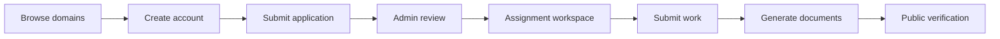

# InternDock

> A full-stack internship platform for discovering programs, managing applications, coordinating assignments, and generating verified internship documents.

<p align="center">
	
</p>

<p align="center">
	<strong>Discover. Apply. Build. Get recognized.</strong><br />
	A focused workspace for interns, program teams, and administrators.
</p>

<p align="center">
	<a href="https://github.com/amanmishra2005/InternDock">Repository</a>
	&nbsp; · &nbsp;
	<a href="https://github.com/amanmishra2005/InternDock/issues">Report an issue</a>
</p>

## What InternDock Does

InternDock brings the internship lifecycle into one place:

- **Explore programs** by domain, duration, skills, and descriptions.
- **Apply online** with student profile and application details.
- **Track progress** through a student dashboard and application workspace.
- **Complete assignments** and submit final work from the same account.
- **Manage operations** through admin dashboards for applications, domains, and users.
- **Generate documents** such as offer letters, certificates, and final reports.
- **Verify documents** publicly using certificate and offer identifiers.
- **Send optional email notifications** through an SMTP provider.

## Product Flow



## Technology

| Layer          | Tools                                             |
| -------------- | ------------------------------------------------- |
| Frontend       | React 18, Vite, React Router, Axios               |
| UI             | CSS, Framer Motion, Lucide React, Canvas Confetti |
| Backend        | Node.js, Express, CommonJS                        |
| Data           | MongoDB, Mongoose                                 |
| Documents      | PDFKit                                            |
| Communication  | Nodemailer, optional SMTP                         |
| Authentication | JWT and bcryptjs                                  |

## Repository Structure

```text
InternDock/
├── Backend/
│   ├── config/       Database connection and seed data
│   ├── middleware/   Authentication and admin authorization
│   ├── models/       Mongoose data models
│   ├── routes/       REST API endpoints
│   ├── seed/         Optional database seeding script
│   └── utils/        PDFs, email, cache, and storage helpers
├── Frontend/
│   ├── public/       Public images and browser assets
│   └── src/          Pages, components, context, API client, and styles
├── .gitignore
└── README.md
```

## Getting Started

### Prerequisites

- Node.js 18 or newer
- npm
- MongoDB running locally, or a MongoDB connection string

### 1. Clone the repository

```bash
git clone https://github.com/amanmishra2005/InternDock.git
cd InternDock
```

### 2. Configure the backend

```bash
cd Backend
npm install
cp .env.example .env
```

Open `Backend/.env` and set a unique `JWT_SECRET`, MongoDB connection string, and admin credentials. The `.env` file is intentionally ignored by Git.

### 3. Start the API

```bash
# Development
npm run dev

# Production-style start
npm start
```

The backend listens on `http://localhost:5001` by default. Its health endpoint is available at `http://localhost:5001/api/health`.

### 4. Start the frontend

In a second terminal:

```bash
cd Frontend
npm install
npm run dev
```

Open the Vite URL shown in the terminal, normally `http://localhost:5173`.

## Environment Variables

The complete template is in [`Backend/.env.example`](Backend/.env.example).

| Variable                                           | Purpose                                          |
| -------------------------------------------------- | ------------------------------------------------ |
| `PORT`                                             | Backend port, default `5001`                     |
| `MONGO_URI`                                        | MongoDB connection string                        |
| `JWT_SECRET`                                       | Secret used to sign authentication tokens        |
| `JWT_EXPIRES_IN`                                   | Token lifetime, such as `7d`                     |
| `CLIENT_URL`                                       | Frontend origin allowed by CORS                  |
| `ADMIN_NAME`                                       | Seeded administrator display name                |
| `ADMIN_EMAIL`                                      | Seeded administrator login email                 |
| `ADMIN_PASSWORD`                                   | Seeded administrator password                    |
| `SMTP_HOST`, `SMTP_PORT`, `SMTP_USER`, `SMTP_PASS` | Optional email delivery settings                 |
| `EMAIL_FROM`                                       | Sender identity for email notifications          |
| `ORG_NAME`, `ORG_SIGNATORY`                        | Organization details used in generated documents |

## Database Seeding

The backend includes domain, duration, assignment, and administrator seed data:

```bash
cd Backend
npm run seed
```

The administrator is created from `ADMIN_NAME`, `ADMIN_EMAIL`, and `ADMIN_PASSWORD`. Never commit real credentials to the repository.

## Available Scripts

### Backend

| Command        | Description                             |
| -------------- | --------------------------------------- |
| `npm start`    | Start the API server                    |
| `npm run dev`  | Start the API with Nodemon              |
| `npm run seed` | Populate the database with initial data |

### Frontend

| Command           | Description                          |
| ----------------- | ------------------------------------ |
| `npm run dev`     | Start the Vite development server    |
| `npm run build`   | Create a production build            |
| `npm run preview` | Preview the production build locally |

## Security Notes

- Runtime secrets belong in `Backend/.env`, never in source code or GitHub.
- Generated uploads, PDFs, local ledgers, database files, logs, and dependency folders are ignored.
- Use a strong, unique `JWT_SECRET` and admin password outside local development.
- Rotate any credential immediately if it has ever been committed publicly.

## License

No open-source license has been selected yet. Add a license before distributing InternDock for reuse.
# InternDock
